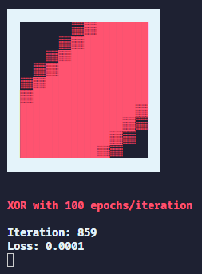

# TensorFlow.js XOR console visualisation
This script uses TensorFlow.js to train a model for solving XOR. After each iteration of training the model, predictions are drawn to the console.

    
    
    
    
    
    
    
  