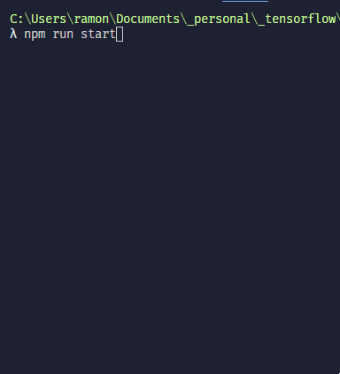

# TensorFlow.js XOR console visualisation
This visualisation uses TensorFlow.js to train a model for solving XOR. After each iteration of training the model, predictions are drawn to the console.

Typing coding along with Daniel Shiffman's [Coding Challenge #106: XOR Problem with TensorFlow.js](https://www.youtube.com/watch?v=N3ZnNa01BPM) and adding my own twists.
    
    
    
    
    
    
    
  